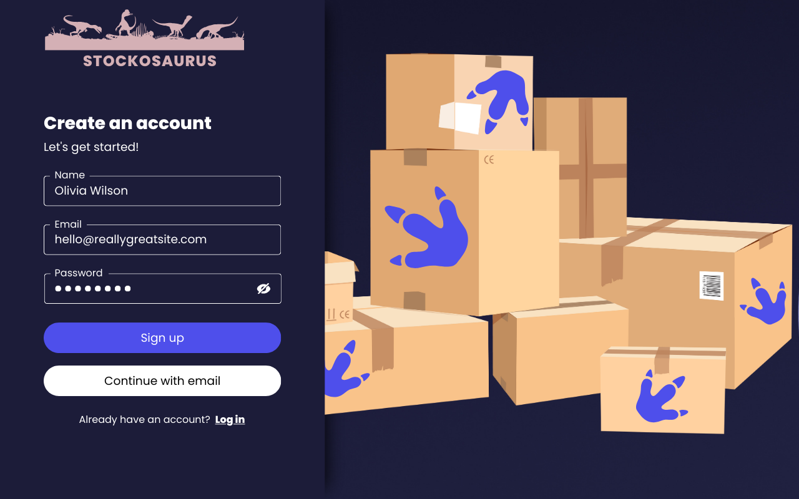
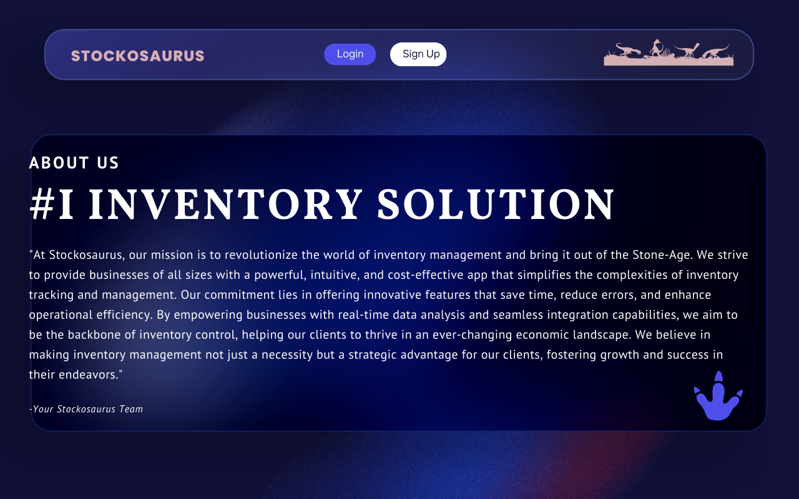

# Stockosaurus - Inventory Management App


## Table of Conten

- [Introduction](#introduction)
- [Features](#features)
- [Getting Started](#getting-started)
  - [Prerequisites](#prerequisites)
  - [Installation](#installation)
- [Usage](#usage)
- [Project Structure](#project-structure)
- [Technologies Used](#technologies-used)
- [Contributing](#contributing)
- [License](#license)
- [Acknowledgements](#acknowledgements)
- [Questions](#questions)


## Introduction

At Stockosaurus, we're on a mission to revolutionize inventory management. This app provides businesses of all sizes with a powerful, intuitive, and cost-effective solution to simplify inventory tracking and management. Our commitment is to offer innovative features that save time, reduce errors, and enhance operational efficiency.

## Features

- **Powerful Inventory Tracking:** Track and manage your inventory with ease.
- **Real-time Data Analysis:** Gain insights through real-time data analysis.
- **Seamless Integration:** Integrate Stockosaurus seamlessly with your existing systems.
- **User-Friendly Interface:** A modern and intuitive user interface for a great user experience.
- **Cost-Effective:** Affordable pricing plans suitable for businesses of all sizes.

## Getting Started






### Prerequisites

- Node.js: [Download and Install Node.js](https://nodejs.org/)
- MongoDB: [Download and Install MongoDB](https://www.mongodb.com/try/download/community)

### Installation

1. Clone the repository:

   ```bash
   git clone https://github.com/jdgiancola/Stockosaurus.git

2. Change into the project directory:
   
   cd stockosaurus

 3. Install dependencies:

     npm install 
     

### Usage

1. Start the server:
  cd server
  npm start


2. Start the client:
   cd client
   npm start


3. Open your browser and navigate to http://localhost:5001.


### Project Structure
```
stockosaurus/
|-- client/
|   |-- public/
|   |-- src/
|   |   |-- components/
|   |   |-- pages/
|   |   |-- hooks/
|   |   |-- api/
|   |   |-- utils/
|   |   |-- assets/
|   |   |-- styles/
|   |   |-- App.js
|   |   |-- index.js
|   |-- package.json
|
|-- server/
|   |-- config/
|   |-- controllers/
|   |-- models/
|   |-- routes/
|   |-- middleware/
|   |-- utils/
|   |-- app.js
|   |-- package.json
|   |-- .env
|
|-- .gitignore
|-- .eslintrc
|-- .prettierrc
|-- README.md
|-- LICENSE
```


###  Technologies Used
Frontend:
React.js
Axios
Backend:
Node.js
Express
MongoDB
Mongoose
GraphQL
Authentication (JWT)
Styling:

CSS
Bootstrap (optional)
Basic CSS

Other Tools:
Git
GitHub
Heroku 

### Contributing
We welcome contributions! Please follow our Contribution Guidelines for details on how to contribute.

### License
This project is licensed under the [MIT License](LICENSE). See the [License](LICENSE) file for more details.

### Acknowledgements
Special thanks to our instructor for taking the time to help us with challenges regarding heroku deployment coupled with providing valuable guidance throughout this project.

### Questions
Have additional questions? Click the links below to reach us through our GitHub account or Email address.

- [Link to Github](https://github.com/amattock)
- [Connect with Alex via Email](mailto:@gmail.com)

- [Link to Github](https://github.com/abdulsamedtma)
- [Connect with Abdul via Email](mailto:abdulsamedtma@gmail.com)

- [Link to Github](https://github.com/jdgiancola)
- [Connect with Joe via Email](mailto:@gmail.com)

- [Link to Github](https://github.com/phillymg)
- [Connect with Philip via Email](mailto:@gmail.com)

 
